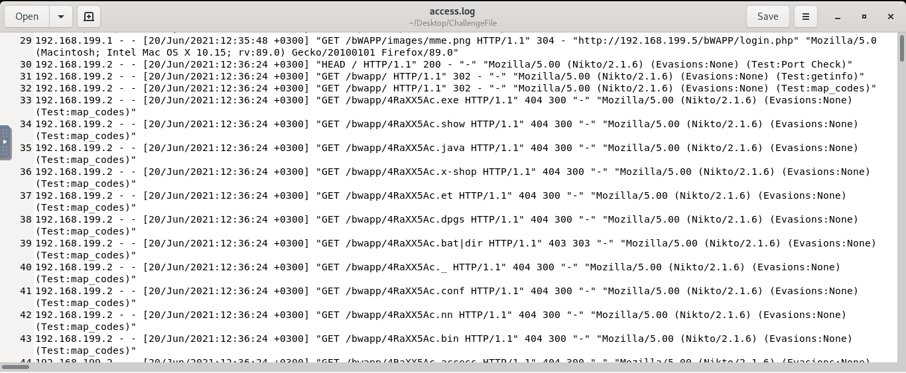
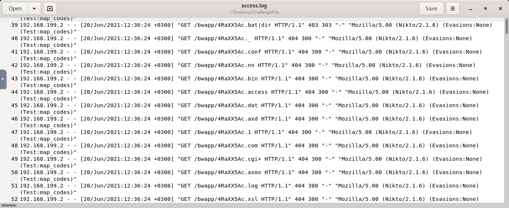
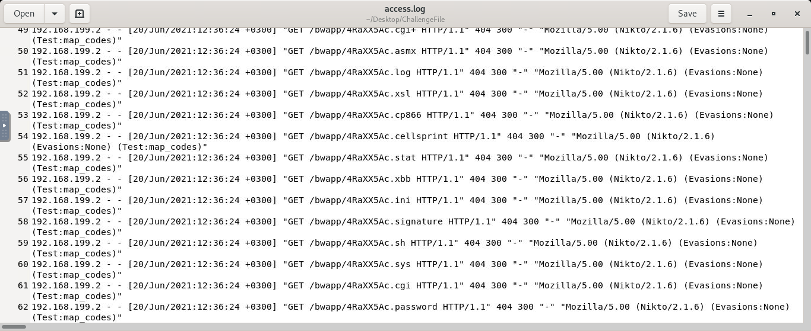
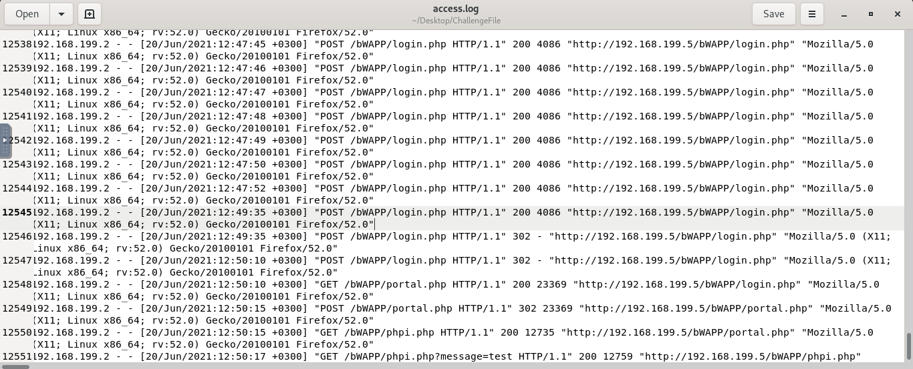
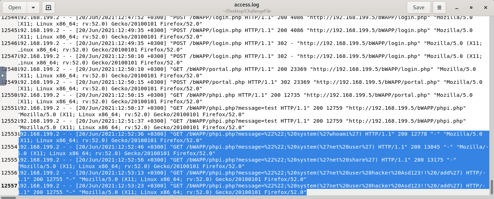

# Investigate Web Attack Challenge

This project is a detailed analysis of a web attack observed in the access log file provided as part of the "Investigate Web Attack" challenge on the [LetsDefend](https://letsdefend.io) platform. This investigation documents each step in the attack chain, showcasing reconnaissance activities, directory listing attempts, brute force attacks, and command injection, with supporting screenshots.

---

## Attack Analysis Summary

### Challenge File
- **Log File Location**: `/root/Desktop/ChallengeFile/access.log`

### Attack Stages and Findings

1. **Reconnaissance with Automated Scan Tool**  
   - **Tool Identified**: `Nikto` - a web vulnerability scanner commonly used for reconnaissance.
   - **Observation**: Nikto probed for web application files and directories to discover vulnerabilities through HTTP requests.

   
  
2. **Directory Listing Discovery (Directory Brute Force)**  
   - **Technique Used**: Directory brute forcing and file enumeration.
   - **Purpose**: To identify sensitive files or configurations by sending HTTP requests for different file types (e.g., `.conf`, `.bat`, `.dat`).
   - **Observation**: Numerous requests to directories and files indicated the attacker’s attempts to brute-force file and directory structures.

   

   
  
3. **Brute Force Login Attempts**  
   - **Targeted Endpoint**: `/bWAPP/login.php`
   - **Technique**: Multiple POST requests suggested a brute-force attempt to access the login portal.
   - **Observation**: A successful login attempt is indicated by a 302 status code (redirection), followed by a GET request to `/bWAPP/portal.php` with a 200 status.

   

4. **Code Injection (Command Injection)**  
   - **Endpoint**: `/bWAPP/phpi.php`
   - **Payload**: Executed command - `system('whoami')`
   - **Observation**: This is a command injection attempt where the attacker tried to execute commands on the server. The `whoami` payload was the first command, confirming the attacker’s access to the server’s operating system level.

   

---

### Detailed Attack Walkthrough

1. **Reconnaissance and Automated Scanning**
   - The attacker began by scanning for files and directories using the **Nikto** tool. This scan aimed to uncover web vulnerabilities by probing for common files, configurations, and server information.
   
2. **Directory Brute Force for Hidden Files**
   - The attacker moved to brute-forcing directories, attempting to locate hidden or sensitive files. Numerous HTTP requests targeting various file extensions suggested brute-forcing activity.

3. **Brute Force Login**
   - Repeated login attempts targeting `/bWAPP/login.php` indicate the attacker’s efforts to break into the web application through brute force. The 302 status code response shows a successful login.

4. **Command Injection Attack**
   - After gaining access, the attacker leveraged command injection to execute system-level commands:
     - **`system('whoami')`** - Confirmed the current user context.
     - **`system('net user')`** - Listed all user accounts on the server.
     - **`system('net share')`** - Revealed network shares.
     - **`system('net user hacker Asd123!! /add')`** - Attempted to create a new user account named "hacker," enabling persistent access.
   - The command injection attempts indicated privilege escalation, with persistence achieved by creating a new user account.  
   
### Persistence Evidence

- **Command**: `system('net user hacker Asd123!! /add')`
- **Description**: The repeated command attempts to add a new user, “hacker,” to maintain unauthorized access even after patching.

---

### Security Recommendations
1. **Terminate unauthorized sessions** and remove unauthorized user accounts.
2. **Patch the vulnerability** enabling command injection on the affected application.
3. **Enhance logging and monitoring** to detect abnormal activities like brute force and command injection attempts.

---

## Acknowledgments
- This investigation was part of the "Investigate Web Attack" challenge on the [LetsDefend](https://letsdefend.io) platform, providing hands-on experience in digital forensics and incident response.

---

